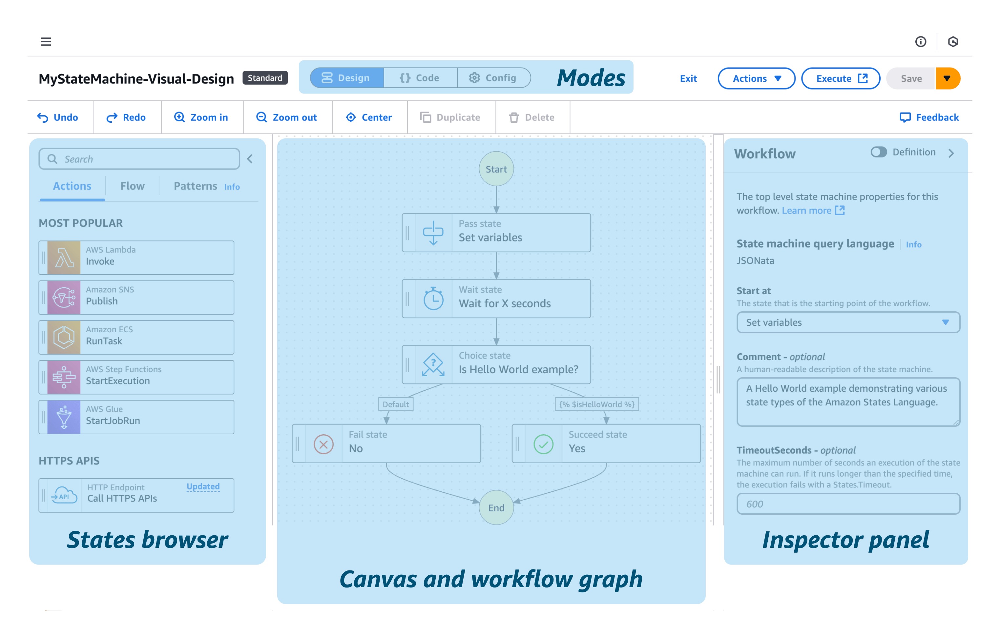

## Amazon Step Function

O Step Functions é um serviço de fluxo de trabalho visual que ajuda os desenvolvedores a usar os produtos da AWS para desenvolver aplicações distribuídas, automatizar processos, orquestrar microsserviços e criar pipelines de dados e machine learning (ML). Utilizando a abordagem de desenvolvimento Low-code.

<b>Low-code</b> é uma abordagem de desenvolvimento de software que utiliza plataformas visuais com interfaces de arrastar e soltar e componentes pré-configurados para criar aplicativos e processos com codificação mínima, ou até mesmo sem codificação alguma em alguns casos. 

-[Documentação](https://docs.aws.amazon.com/step-functions/latest/dg/welcome.html)

