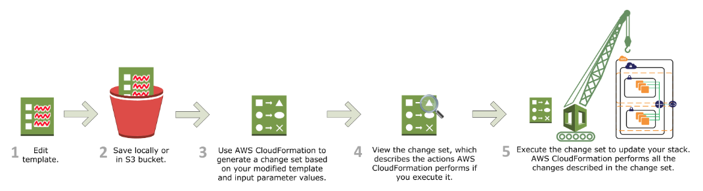

## AWS CloudFormation

O AWS CloudFormation é um serviço que ajuda você a modelar e configurar seus recursos da AWS para despender menos tempo gerenciando esses recursos e mais tempo se concentrando em seus aplicativos executados AWS. Você cria um modelo que descreve todos os recursos da AWS desejados (como funções do Amazon EC2 e tabelas do Amazon RDS), e o CloudFormation cuida do provisionamento e da configuração desses recursos para você.

Auxilia na automação de criação de recurso na AWS por meio de templates JSON ou YAML.
Podemos utilizar os templates quantas vezes quisermos e pagar apenas pela stack criada. (ex: EC2, RDS, etc)

#### Principais conceitos: 
- Templates / (Modelos)
- Stacks / (Pilhas)
- Change sets / (Conjuntos de alterações)

### 📖 [Documentação](https://docs.aws.amazon.com/pt_br/AWSCloudFormation/latest/UserGuide/Welcome.html)
### 📖 [Criando sua primeira stack](https://docs.aws.amazon.com/pt_br/AWSCloudFormation/latest/UserGuide/gettingstarted.walkthrough.html)

